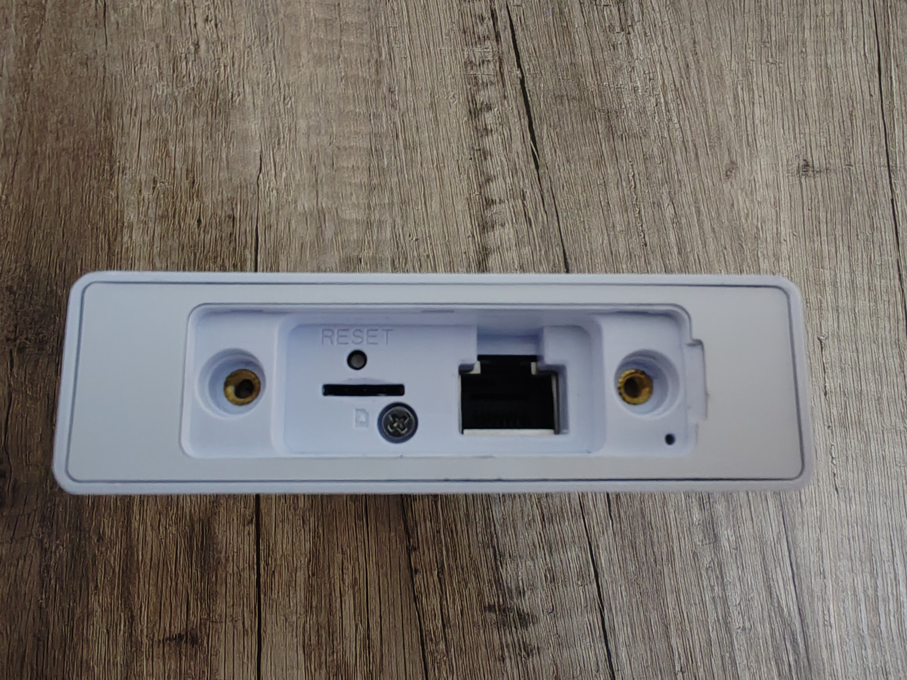
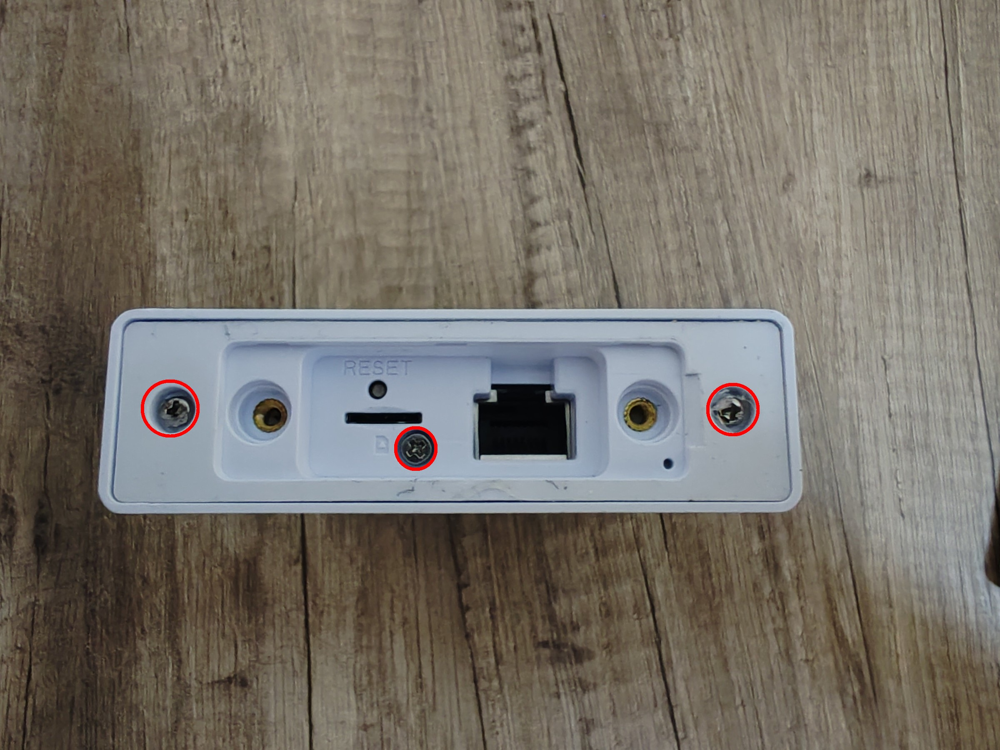
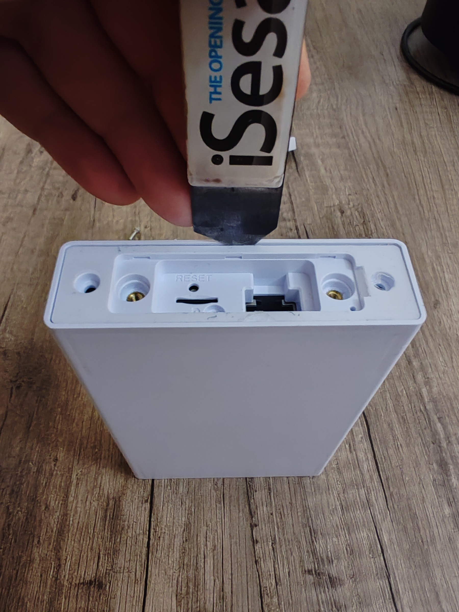
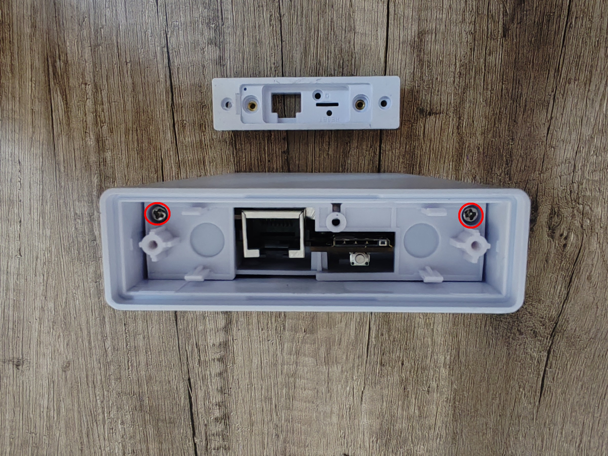
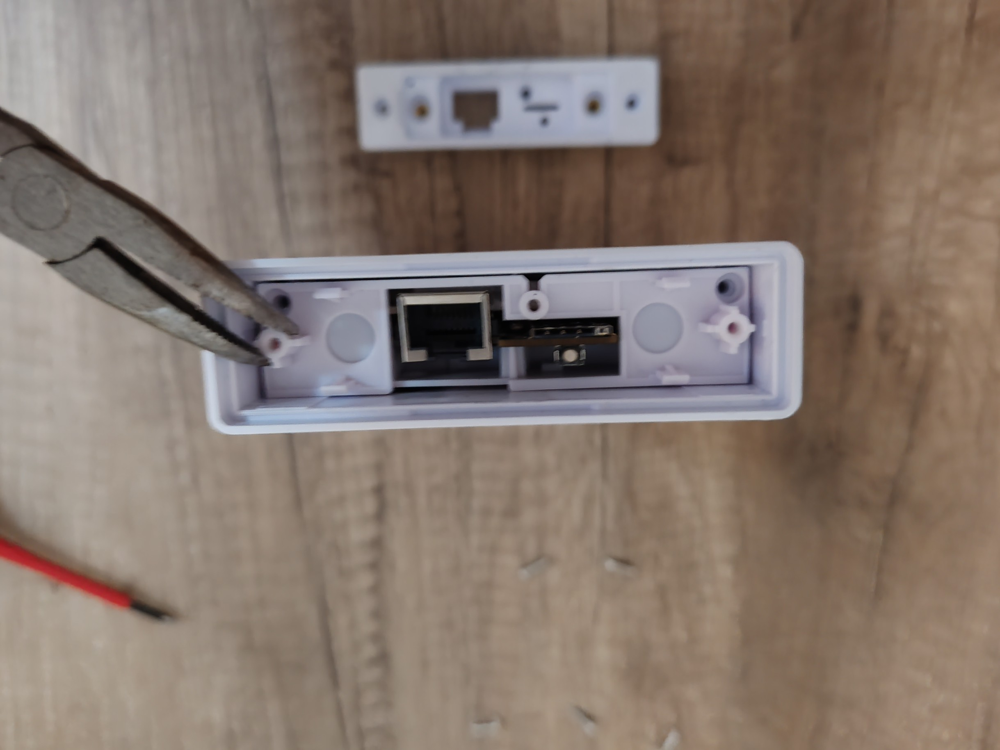
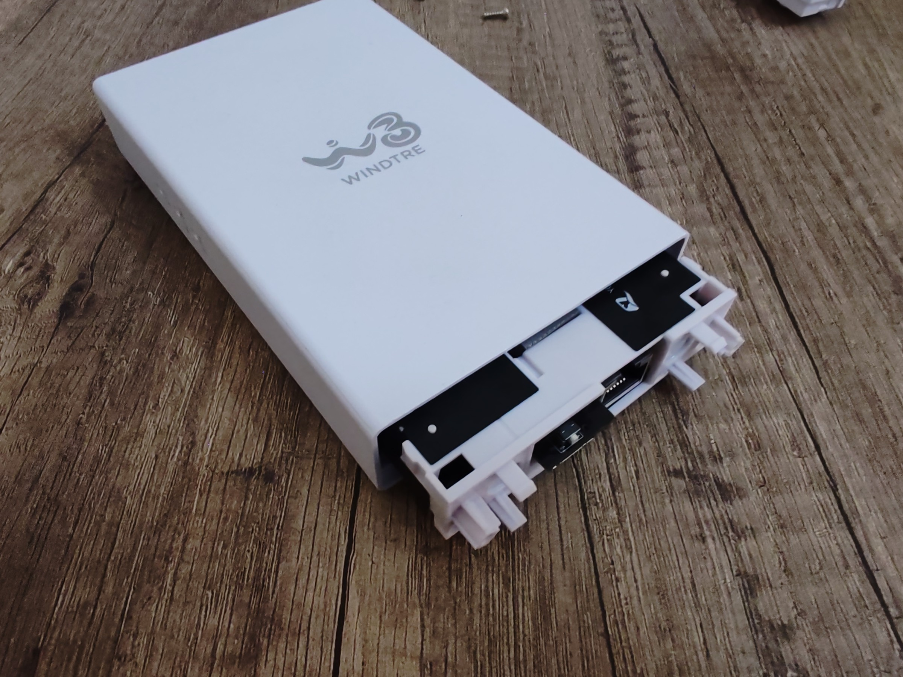
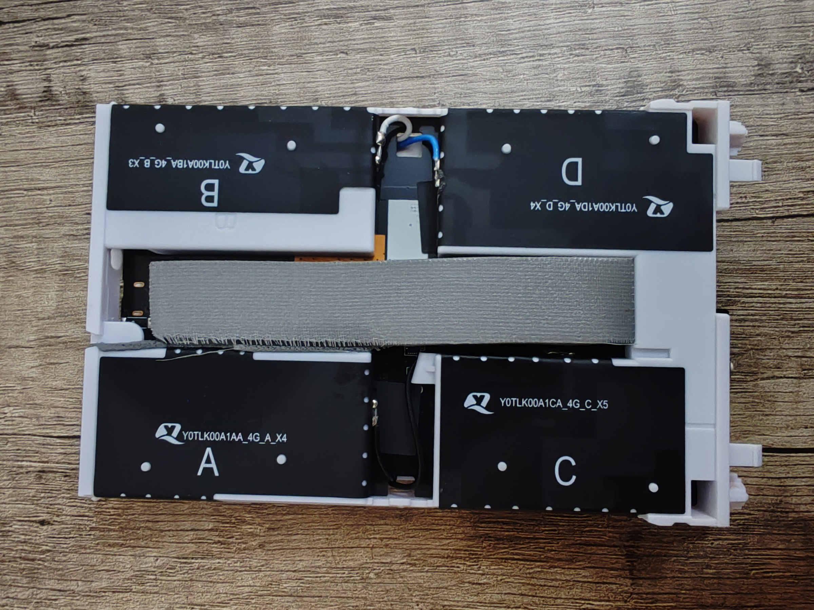
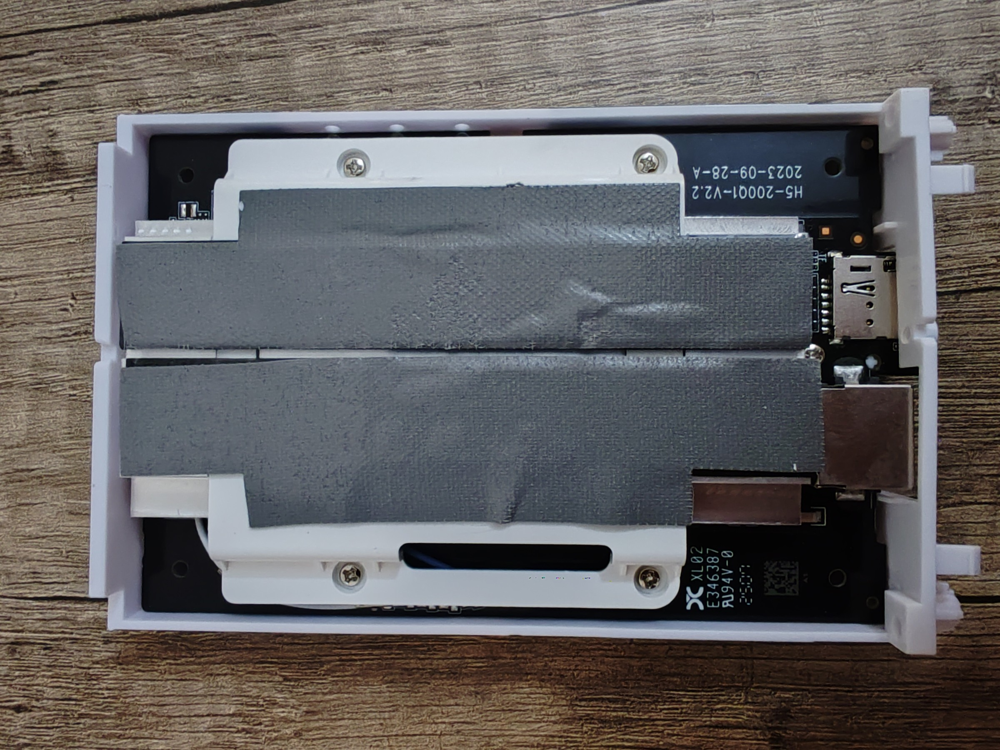
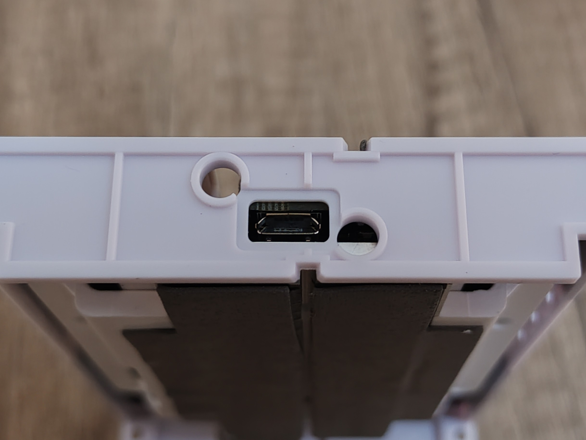

# Disassembly guide

1. Place your unit upside down and remove the plastic shield glued to the bottom. 

2. Remove the three screws

3. Remove the plastic block using a opener 

4. Remove two screws

5. Using some pliers gently pull from a strong part like the seat of the screw

6. Extract the unit

7. Photos of the unit + micro USB diagnostic port

